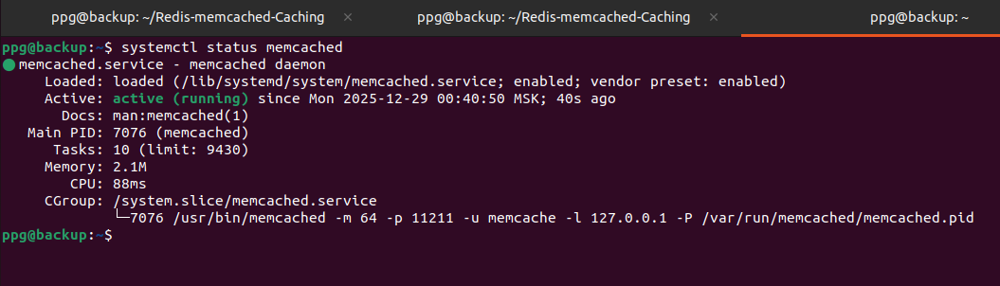
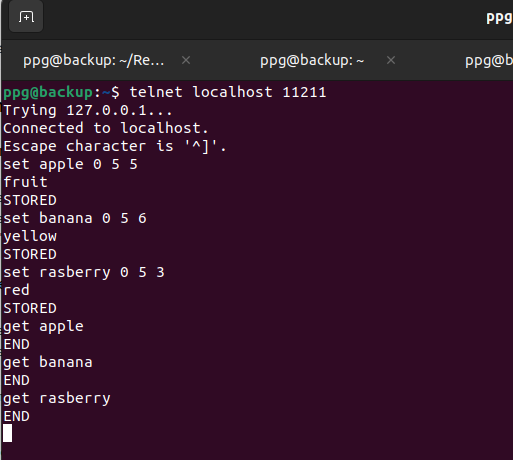
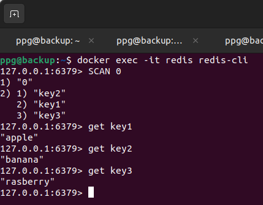

# Домашнее задание к занятию «Кеширование Redis/memcached» - Петр Петров
### Задание 1. Кеширование
Приведите примеры проблем, которые может решить кеширование.  
**Ответ:**  
1. Уменьшение времени доступа к данным.  
Частые запросы к базе данных могут приводить к задержкам в ответах из-за времени, необходимого для выполнения запросов. Кеширование результатов запросов позволяет избежать повторного обращения к базе данных, что значительно снижает время ответа. Например, если приложение часто запрашивает одни и те же данные, кеширование этих данных в памяти позволяет мгновенно предоставлять их пользователям, что улучшает общий пользовательский опыт.  
2. Снижение нагрузки на серверы.  
Высокая нагрузка на серверы может привести к их перегрузке и снижению производительности. Кеширование часто запрашиваемых данных снижает количество запросов к основным серверам, разгружая их и позволяя им обрабатывать другие запросы более эффективно. Это особенно актуально для веб-приложений, где одновременно может быть много пользователей, и кеширование помогает поддерживать стабильную работу системы.  
3. Повышение масштабируемости.  
С увеличением числа пользователей система может испытывать трудности с обработкой запросов. Кеширование позволяет распределить нагрузку, так как данные могут быть закешированы на различных уровнях (например, на уровне приложений или прокси-серверов), что упрощает масштабирование системы. Это дает возможность легко добавлять новые серверы или ресурсы без необходимости значительных изменений в архитектуре приложения.  
4. Ускорение загрузки страниц.  
Долгое время загрузки страниц может негативно сказаться на пользовательском опыте. Кеширование статического контента (изображений, CSS, JavaScript) позволяет быстро загружать страницы без необходимости повторных запросов к серверу. Это особенно важно для сайтов с большим объемом графики, где кеширование может существенно сократить время загрузки и повысить удовлетворенность пользователей.  
5. Оптимизация работы с API.  
Частые вызовы к внешним API могут привести к превышению лимитов запросов и увеличению времени ожидания. Кеширование ответов от API позволяет повторно использовать данные, уменьшая количество вызовов и ускоряя доступ к информации. Это помогает избежать проблем с производительностью и снижает затраты на использование сторонних сервисов, обеспечивая более стабильную работу приложения.  
6. Обработка больших объемов данных.  
Обработка больших объемов данных может занимать много времени и ресурсов. Кеширование промежуточных результатов вычислений позволяет избежать повторной обработки одних и тех же данных, что экономит время и ресурсы. Это особенно полезно в аналитических приложениях, где результаты сложных вычислений могут быть закешированы для последующего быстрого доступа, минимизируя нагрузку на систему.  

### Задание 2. Memcached
Установите и запустите memcached.  
Приведите скриншот systemctl status memcached, где будет видно, что memcached запущен.  
**Ответ:**  
 
Cкриншот с командой и результатом ее выполнения:  

   

### Задание 3.  Удаление по TTL в Memcached  
Запишите в memcached несколько ключей с любыми именами и значениями, для которых выставлен TTL 5.  
Приведите скриншот, на котором видно, что спустя 5 секунд ключи удалились из базы.  

**Ответ:**  
Cкриншот, на котором видно, что спустя 5 секунд ключи удалились из базы  

   

### Задание 4. Запись данных в Redis
Запишите в Redis несколько ключей с любыми именами и значениями.  

Через redis-cli достаньте все записанные ключи и значения из базы, приведите скриншот этой операции.  

**Ответ:**  

Cкриншот записанных ключей:  

   
